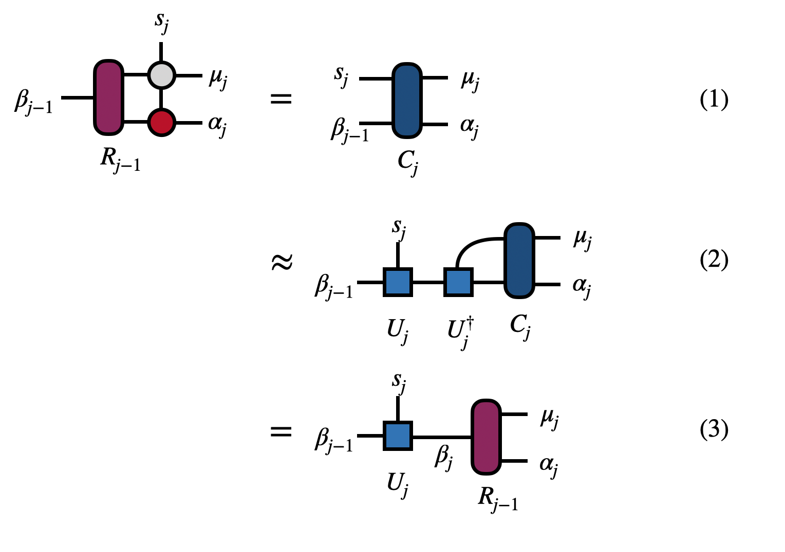

# MPO-MPS Multiplication: Zip-Up Algorithm

The zip-up algorithm gives an efficient
way to multiply or apply a [[matrix product operator (MPO)|mpo]] 
onto a [[matrix product state (MPS) / tensor train|mps]].
It is one of the fastest algorithms for this purpose, and relatively
easy to implement, but has a downside of not being fully controlled (see discussion below).

## Statement of the Problem

Given an MPS of bond dimension or rank $\chi$ and an MPO of rank $k$,
we want to represent their product as another MPS of bond dimension $\chi$.
In other words, we want to compute the MPS on the right-hand side of the following
equation:

such that the Euclidean distance between the two sides of the equation
are minimized.

## Properties of the Algorithm

* **Scaling:** $N\cdot(\chi^3 k d^2 + \chi^2 k^2 d^2)$ where $N$ is the length of the MPS (number of external indices), $\chi$ is the MPS rank, $k$ is the MPO rank, and $d$ is the local dimension (size of external indices).
* **Direct?** Yes, computes result in a single pass and always succeeds.
* **Controlled?** No, errors not strictly bounded by the individual truncations made in each step.

## Steps of the Algorithm

The algorithm begins by contracting the first tensor of the MPO and the MPS together

to form the tensor $C_1$. Next the tensor $C_1$ is factorized to obtain the unitary matrix $U_1$. To obtain $U_1$, one can factorize $C_1$ with the singular value decomposition (SVD) taking $s_1$ to be the row index and $(\mu_1,\alpha_1)$ as the collective column index. Then by multiplying $C_1$ by $U^\dagger_1$, we obtain the tensor $R_1$

Above, the index $\beta_1$ is the new index introduced by the factorization.

As a technical note, because only $U_1$ is needed, it is possible to obtain it more efficiently than with an SVD. For instance, one could compute the eigenvalue factorization of $C_1 C^\dagger_1$ or use a rank-revealing QR factorization.

The tensor $U_1$ is the first core of the new MPS.

To continue the algorithm at steps $j=2,3,\ldots,(N-1)$, repeat the steps shown and described below:

In step (1) one contracts $R_{j-1}$ from the previous step with the next MPO and MPS tensors (scaling $\chi^3 k d + \chi^2 k^2 d^2$) to form $C_j$. 

In step (2), the tensor $C_j$ is factorized (such as by an SVD) by treating $(\beta_{j-1},s_j)$ as the collective row index to obtain $U_j$ (scaling $\chi^3 \cdot \min(k d^2, k^2 d)$. 

In step (3), applying $U^\dagger_j$ to $C_j$ gives the $R_j$, the input to the next step.

After all the steps are complete, the $U_j$ from each step are the core tensors $U_1, U_2, \ldots, U_{N-1}$ of the new MPS and $R_N$ is the last tensor of the new MPS.

## Accuracy of the Zip-Up Algorithm

Because the combined basis $(\mu_j, \alpha_j)$ on the right-hand side of each factorization (each SVD, say) does not correspond to an orthonormal basis, the errors reported by truncating each factorization can not necessarily be interpreted as global errors. That is, the total error afterward is not bounded by summing these local errors. However, in practice making the local errors smaller (by truncating less) tends to reduce the actual, global error.

Some "best practices" can be used to make the zip-up algorithm more likely to be accurate. One is to bring both the input MPS and MPO into "orthogonal form" with the first site as the orthogonality center. (For the MPO, this can be done by treating it as an MPS with two external indices on each tensor.) Using this orthogonal form ensures that the factorizations are not drastically ill-conditioned.

Another best practice is to control the errors in the factorizations not by enforcing a strict maximum rank, but by enforcing a truncation-error cutoff which adaptively determines the rank. If a certain maximum rank is desired, this can always be enforced by a second backward pass compressing the output MPS.

## More Information

The zip-up algorithm was first described in the paper [Minimally Entangled Typical Thermal State Algorithms](https://iopscience.iop.org/article/10.1088/1367-2630/12/5/055026/meta) \cite{METTS_Algorithms}. Note that the published version has a slight inaccuracy about the scaling of the algorithm and the correct scaling is given above (thanks to [Robert Pinkston](https://www.linkedin.com/in/robert-pinkston-pe-14942882/) for pointing this out).

